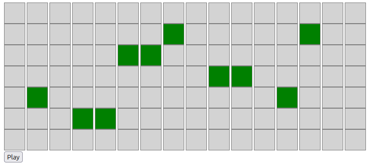
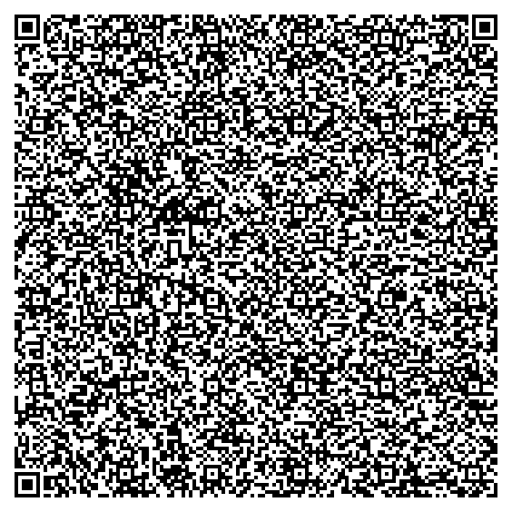

# QR Code Music Game

## Project Description
This project is a QR Code Music Game that allows to create and play music by interacting with a grid-based interface.  
You can create music by toggling cells in the grid, similar to playong notes on a piano.
The game logic is implemented in the code, and the entire code is embedded in a QR code.

## Files

 - `readable_code.js` contains the code of the game
 - `code.js` is the compressed version of the code, made so that it takes the least amount of storage space possible
 - `qr_code.js` is the script that generates the qr code

## QR Code Integration
The QR code generated by this project contains the entire game code. When scanned, it will load the game in a browser, allowing users to interact with the music grid and create music. (You may have to copy and paste the text contained into your browser)

